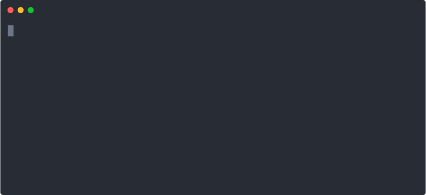

# Remark42 MongoDB Server


[](https://codecov.io/github/daniloarcidiacono/remark42-mongodb) 


[](https://opensource.org/licenses/MIT)

Store [Remark42](https://remark42.com/) comments, images and avatars on MongoDB. \
Tested with [Remark42 v1.10.1](https://github.com/umputun/remark42/releases/tag/v1.10.1).

> **Warning**
> The fix for the following issues on Remark42 are required for Remark42 MongoDB Server to work:
> 
> - [Type cast panic when using RPC](https://github.com/umputun/remark42/issues/1475)
> - [Key() method invoked with wrong siteID](https://github.com/umputun/remark42/issues/1499)
> 
> Until version v1.10.2 is released it's mandatory to build Remark42 from its `master` branch.

## Setup
Initialize the server with `remark42-mongodb.js init`:

<p align="center">
  
</p>

A configuration file `remark42-mongodb.json` is created: 

```json
{
    "port": 9000,
    "hostname": "localhost",
    "database": "mongodb://localhost:27017/remark42-mongodb",
    "avatars": "remark_avatars",
    "bodyLimit": "8mb",
    "dynamicPosts": true,
    "logDir": "logs",
    "logMaxSize": "8m",
    "logMaxFiles": 30
}
```

The following options are available:
- **`port`**: the TCP port on which the Remark42 MongoDB Server listens for client connections;
- **`hostname`**: the hostname where to listen for client connections;
- **`database`**: the MongoDB connection URI;
- **`avatars`**: Remark42 can be configured to store avatars in a GridFS bucket. This optional setting is the name of the GridFS bucket; once configured, remark42-mongodb periodically cleans up unused avatars;
- **`bodyLimit`**: maximum size of request bodies, should be calibrated accordingly to the maximum image size accepted by Remark42 (`IMAGE_MAX_SIZE`);
- **`dynamicPosts`**: if `true`, any post referenced by comments is created if not existing; if `false`, comments referencing a non-existing post are rejected: in that case, available sites/posts must be initialized either by hand or by using `sites create`  and `posts create` commands;
- **`logDir`**: logs folder path;
- **`logMaxSize`**: the maximum size for each log file (e.g. `32k`, `8m`, `2g`).
- **`logMaxFiles`** (optional): maximum number of days the logs are kept; if omitted, logs are kept indefinitely;

All options can be overridden via `REMARK42_MONGODB_XXX` environment variables, for example `REMARK42_MONGODB_DATABASE`
or `REMARK42_MONGODB_LOG_MAX_SIZE`.

## Running
Start the server with `remark42-mongodb.js serve`.

Three log files are created:
- **`access-YYYY-MM-DD.log`**: collecting information about served requests;
- **`error-YYYY-MM-DD.log`**: collecting errors;
- **`main-YYYY-MM-DD.log`**: collecting general information;

Log files are rotated daily and are limited both in size (`logMaxSize`) and number (`logMaxFiles`).

## Health check
Service health can be checked by sending a `GET /health` request, that will respond with `200 OK` or `503 Service Unavailable` depending on the state of the server and database connection.

## Managing sites
New sites can be created with `remark42-mongodb.js sites create [name]`:

<p align="center">
  
</p>

Sites **must be created** regardless of whether `dynamicPosts` is set to `true` or `false`. \
The encryption key and email are described on [Remark42 documentation](https://remark42.com/docs/configuration/parameters/),
respectively `SECRET` and `ADMIN_SHARED_EMAIL`. \ 
Note that Remark42 MongoDB Server handles different values for each site (i.e. they are not "shared").

Current sites can be listed with `remark42-mongodb.js sites list`:

<p align="center">
  
</p>

## Managing posts
New posts can be created with `remark42-mongodb.js posts create [site] [url]`:

<p align="center">
  
</p>

This is useful for initializing the database when `dynamicPosts` is set to `false`. \
The posts on a specific site can be listed with `remark42-mongodb.js posts list [site]`:

<p align="center">
  
</p>

## Remark42 configuration
Set the following environment variables in Remark42 to enable integration with Remark42 MongoDB Server (adjust values according to your configuration):

```properties
STORE_TYPE=rpc
STORE_RPC_API=http://localhost:9000

ADMIN_TYPE=rpc
ADMIN_RPC_API=http://localhost:9000

IMAGE_TYPE=rpc
IMAGE_RPC_API=http://localhost:9000
```

Remark42 can also store avatars in a GridFS bucket with the following configuration:

```properties
AVATAR_TYPE=uri
AVATAR_URI=mongodb://localhost:27017/remark42-mongodb?ava_db=remark42-mongodb&ava_coll=remark_avatars
```

> **Warning**
> At the moment `mongodb+srv` URIs (used by MongoDB Atlas) are not handled correctly ([open issue](https://github.com/go-pkgz/auth/issues/127)).

Remark42 MongoDB Server can periodically clean up unused avatars by configuring `avatars` to `remark_avatars`. 

More information on how to configure Remark42 available at [Remark42 documentation](https://remark42.com/docs/configuration/parameters/).
